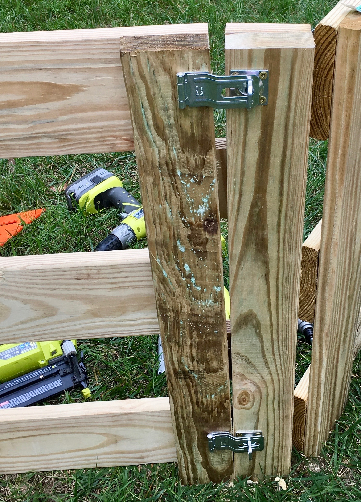

&copy; 2019 Jason Luther. All rights reserved. 

# DIY Gaga Pit

[Gaga ball](https://youtu.be/-qxFzAmkFG8) is a game my kids enjoy, so we built two gaga "pits" to play in. One is a retractable pit on our [bocce court](https://github.com/jasonluther/bocce/), and the other is in a family member's back yard. 

We'll focus on the back yard version. It's a really simple build that can be done in an afternoon with basic tools. 

This design is meant to be as cheap as possible and quick to build. You can certainly use better/more materials and get a nicer result if you are willing to spend more time or money, but we're happy with this version. 

I'll also show how to add a gate to the pit so that you can get a lawn mower into it. 

You can also see this guide on [Instructables](https://www.instructables.com/id/Gaga-Pit/). 

### Be safe

Any construction project can be dangerous or fatal, so please take appropriate safety precautions and consult a professional when you need help. 

Use a respirator when cutting wood, especially if it's pressure-treated. Use hearing protection when using power tools. Always wear safety glasses. 

Also, playground equipment can be dangerous or fatal, so consider your audience when choosing the materials and dimensions. This project is plenty sturdy for my little ones and their cousins, but you might want to add more brackets or more vertical supports if you expect more climbing or use by older kids. 

I am not a professional, and I am just sharing my experience for information and entertainment purposes. I cannot be held responsible for any damage or injuries that result from actions you take. 

### Steps

These are the steps:

1. Determine materials based on the size of the pit
2. Choose your tools
3. Assemble
4. Optional: add a gate
5. Play!

## Materials and Dimensions

There are three key materials:

 * [1x6 pressure-treated lumber](https://www.lowes.com/pd/Severe-Weather-Common-1-in-X-6-in-x-8-ft-Actual-0-75-in-x-5-5-in-x-8-ft-Treated-Lumber/4758192) (23 8' boards)
 * [1-1/4" exterior screws](https://www.lowes.com/pd/Grip-Rite-PrimeGuard-Plus-8-x-1-1-4-in-Gold-Polymer-Deck-Screws-1-lb/1000118269) to join everything together (about 100)
 * [Framing angles](https://amzn.to/2FYDrZh) to connect the sections (12)

The framing angles that make the connection are what make this project so simple. 

Use screws that are compatible with pressure-treated lumber. 

The total cost of materials should be around $200. 

### Dimensions

Our pit has 6 sides that are 8' wide and about 28" tall. 

The size is arbitrary: anything between 20-48" will work, and the overall size is dictated by the amount of space you have and the budget. 

I chose the 28" height because it was easy enough for kids to climb into, but the gap is small enough to keep the ball inside the pit while only using 3 courses of lumber. 

Each side is 8' because I bought 8' boards. Based on the available space and the expected number of players, I chose a hexagon. 

As built here, you'll need at least 22 8' boards. 18 are for the horizontal pieces (3 per side, 6 sides). 4 are for the vertical pieces: at 28", you get three from each 8' board. 

If you add in the gate, you'll need two more vertical supports. You may notice some 2x4s in my build (in place of the 1x6s). If you stick with the 1x6, add one more board to your purchase. 

### Sources

I have included links to some of the materials and tools I used. Some of those are affiliate links, so I may earn a commission on purchases made through those links. 

However, I would much prefer if you bought these things from a local supplier instead of Amazon. With any DIY project, you're likely to make multiple trips to the store, and you're going to want advice from experts. 

None of this content is otherwise sponsored.

## Tools

This project requires minimal tools. The only essential is something to drive screws, and it doesn't have to be a powerful drill/driver. 

A hand saw is sufficient, and your lumber supplier might be able to cut the vertical pieces for you. 

You don't even need a [tape measure](https://amzn.to/2MxqruF)! I chose the vertical support dimensions by stacking up 5 boards. Once you've cut one, use it to mark and cut the rest. 

Here's what I used: 

 * [Drill](https://amzn.to/2ymaIIh)/[driver](https://amzn.to/2ymm27v) for attaching boards
 * [Hammer](https://amzn.to/2CMGNuX) for bending the brackets to the right angle
 * [Saw](https://amzn.to/2IHGRyX) for cutting boards
 * [Speed square](https://amzn.to/2yhrnN2), a guide for making circular saw cuts and squaring up each section: $8
 * Safety
   * [Ear protection](https://amzn.to/2OZ2du3): $22
   * [Safety glasses](https://amzn.to/2NMfDNc): $7
   * [Respirator](https://amzn.to/2NsngU4) with [3M 2097](https://amzn.to/2C1Dh1c) cartridge: $24

## Assembly

To prepare the materials, there are only two steps: 

1. Cut your vertical supports to size.
2. Bend the brackets from 90&deg; to 120&deg; by stacking them up and hammering them until they spread out enough.

Then lay out each set of sides and attach each horizontal piece to the vertical supports using a couple of screws at each connection. 

You'll want some help when it comes time to join the sides with the brackets. Join the bottom first and then the top. 

At this point, you're ready to play Gaga!

## Add a Gate 

In order to get a lawn mower into the pit, I turned one of the sides into a gate. Because I hadn't planned for this initially, it was a bit awkward to add one. The solution was to add two more vertical supports, add [hinges](https://amzn.to/2FLDFU8) and [latches](https://www.lowes.com/pd/Gatehouse-3-1-2-in-Zinc-Swivel-Hasps/4777888), and then cut out the gate. 

One the left side, I attached a vertical support, leaving space for the hinge knuckle. Then I attached [two hinges](https://amzn.to/2FLDFU8). Any hinges that are strong enough will do. 

On the other side, I attached another vertical support, right next to the existing support. Then I attached the [latching hasps](https://www.lowes.com/pd/Gatehouse-3-1-2-in-Zinc-Swivel-Hasps/4777888). 

Once the hardware was attached, I unscrewed the gate section, set it down, and then used the circular saw to cut the horizontal boards in between the vertical supports. Then I reinstalled the section. 

To help things line up, I added a few cutoffs on the back of the latch side. 

The gate isn't necessarily easy to open, but it's good enough. My biggest concern was making sure that nobody would get fingers pinched in the open spaces. 

## Play!

Gaga is a fun game for the whole family. It's a tamer version of dodgeball. 

For a harder surface, like our bocce court, a [kickball](https://amzn.to/2ThCQWk) is great. But for grass, you will want something lighter, like the kind of bouncy ball you'd get in the grocery store toy section. 

Like any respectable playground game, there are many variations of the rules. These are the basics:

1. You bat the ball with an open hand. You don't catch the ball or throw it. 
2. You can only touch the ball once. You can't touch it again until it touches someone else or the wall. 
3. If the ball hits you at the knees or below, you're out. You have to leave the pit. 
4. If you hit the ball out of the pit, you're out. 
5. The last one standing wins. 
